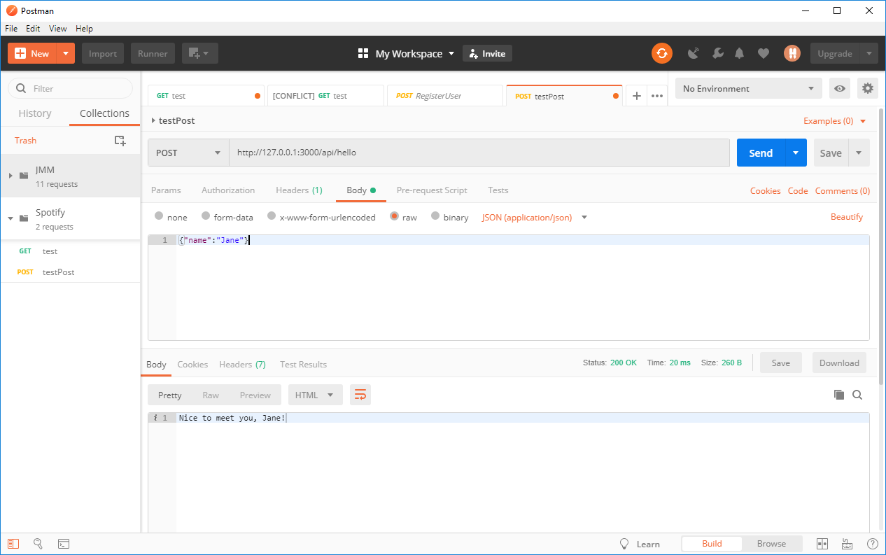

# QShare [](https://travis-ci.com/IOOPM-UU/QShare)

# Frontend instructions
Run the following in the frontend folder to install required packages
```
npm install
```

To start the frontend server run
```
npm start
```

# Backend instructions
Run the following in the backend folder to install required packages
```
npm install
```

To start the backend server run
```
npm start
```

To run the tests run
```
npm test
```

## Verifying that the backend server is working
Install Postman (or a similiar tool).

You should be able to send a GET and POST request to http://127.0.0.1:3000/api/hello

Please note that you need ot set Content-Type in header to application/json when sending body data in a POST request



# Infrastructure for Weekly Report
- [Google Sheet](https://docs.google.com/spreadsheets/d/1cjB0Z42xmFW32aBV-RyJgqA-kDC7FpqqFkRQptqRWwY/edit?usp=sharing) for creating the Burn-down chart.
- [Overleaf document](https://www.overleaf.com/1494984818mgrgxcqnvpyz) with the template report.
